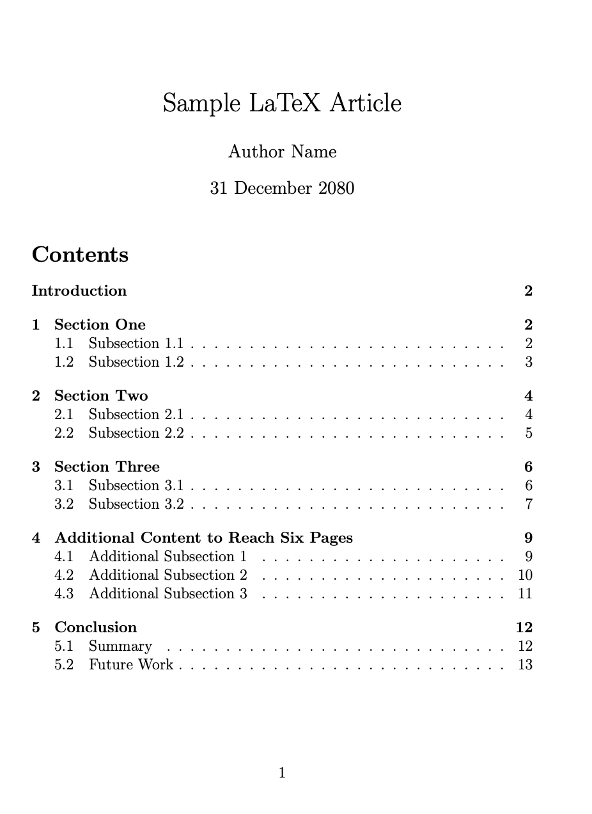
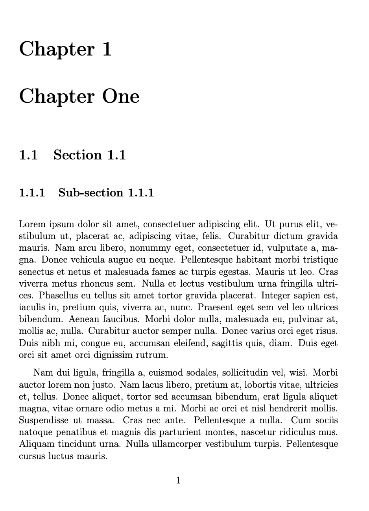

# Workshop 02

## LAB. 1

Prepare an article document with the contents satisfing the following conditions:

- At least 3 numbered sections;
- At least 1 un-numberd section;
- For each numberd section, it contains at least 2 numbered sub-sections;
- The table of contents lists every numbered sections at the very beginning of the document.
- The article consists of, at least, 6 pages.

The result must be in PDF format showing contents aligned with the mentioned conditions.

### Example

## LAB. 2

Prepare a book with the contents satisfing the following conditions:

- At least 4 chapters;
- For each chapter, it contains at least 3 sections;
- For each section, it contains at least 2 sub-sections;
- The table of contents lists every chapters and sections, which are placed before the contents.
- The book consists of, at least, 20 pages.

The result must be in PDF format showing contents aligned with the mentioned conditions.

### Example

 