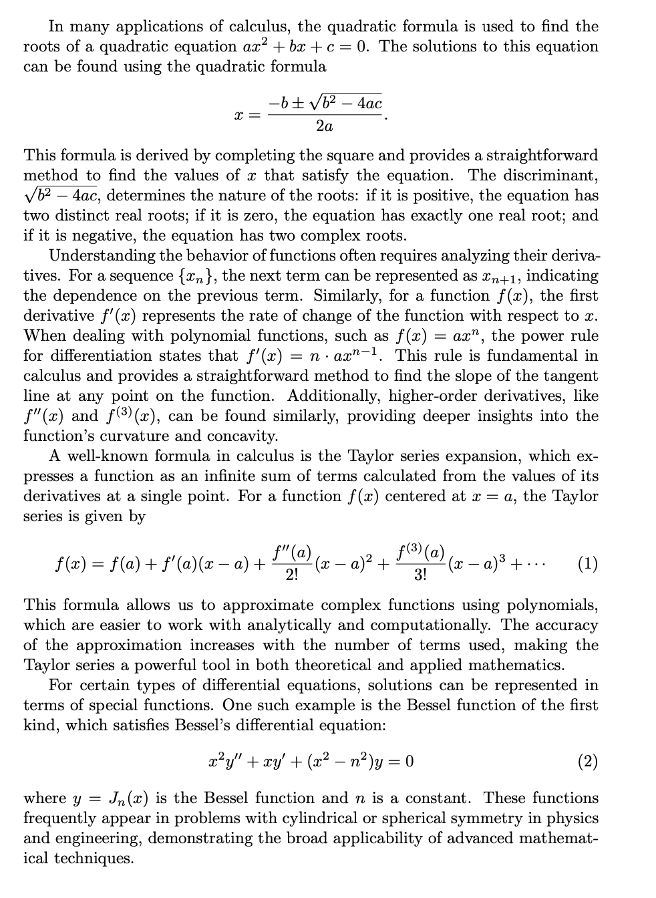

# Workshop 04

## LAB. 1

Prepare an article document with the contents consisting the following mathematics expressions:

Understanding the behavior of functions often requires analyzing their derivatives. For a sequence $ \{x_n\} $, the next term can be represented as $ x_{n+1} $, indicating the dependence on the previous term. Similarly, for a function $ f(x) $, the first derivative $ f'(x) $ represents the rate of change of the function with respect to $ x $. When dealing with polynomial functions, such as $ f(x) = ax^n $, the power rule for differentiation states that $ f'(x) = n \cdot ax^{n-1} $. This rule is fundamental in calculus and provides a straightforward method to find the slope of the tangent line at any point on the function. Additionally, higher-order derivatives, like $ f''(x) $ and $ f^{(3)}(x) $, can be found similarly, providing deeper insights into the function's curvature and concavity.

A well-known formula in calculus is the Taylor series expansion, which expresses a function as an infinite sum of terms calculated from the values of its derivatives at a single point. For a function $ f(x) $ centered at $ x = a $, the Taylor series is given by
$$
f(x) = f(a) + f'(a)(x - a) + \frac{f''(a)}{2!}(x - a)^2 + \frac{f^{(3)}(a)}{3!}(x - a)^3 + \cdots
$$
This formula allows us to approximate complex functions using polynomials, which are easier to work with analytically and computationally. The accuracy of the approximation increases with the number of terms used, making the Taylor series a powerful tool in both theoretical and applied mathematics.

The result must be in PDF format showing contents aligned with the mentioned conditions.

### Example

