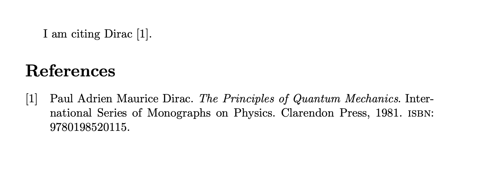
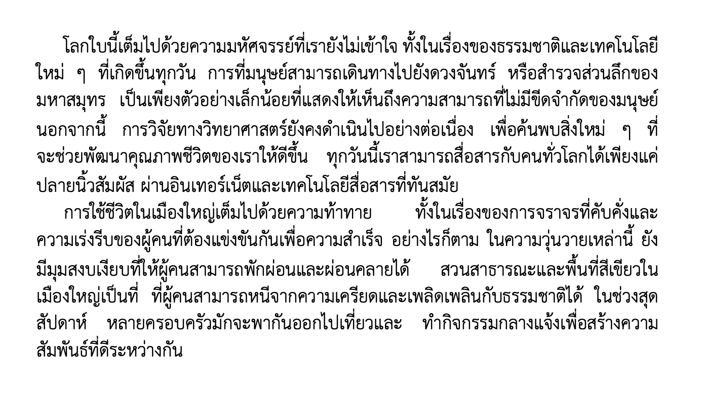

# Workshop 05

## LAB. 1

Prepare an article document with the contents consisting the following texts and references:

```tex
\documentclass{article}

\usepackage[backend=biber]{biblatex}
\addbibresource{mybib.bib}

\begin{document}
I am citing Dirac \cite{dirac}.

\printbibliography

\end{document}
```

And here is the `bib` file contents:

```tex
@book{dirac,
  title={The Principles of Quantum Mechanics},
  author={Paul Adrien Maurice Dirac},
  isbn={9780198520115},
  series={International Series of Monographs on Physics},
  year={1981},
  publisher={Clarendon Press},
  keywords = {physics}
}
```

The result must be in PDF format showing the bibliography.

### Example




## LAB. 2

Prepare an article document with the contents consisting Thai characters:

```tex
% !TEX program = xelatex

\documentclass{article}
\usepackage{thaispec}

\begin{document}

โลกใบนี้เต็มไปด้วยความมหัศจรรย์ที่เรายังไม่เข้าใจ 
ทั้งในเรื่องของธรรมชาติและเทคโนโลยีใหม่ ๆ 
ที่เกิดขึ้นทุกวัน การที่มนุษย์สามารถเดินทางไปยังดวงจันทร์
หรือสำรวจส่วนลึกของมหาสมุทร 
เป็นเพียงตัวอย่างเล็กน้อยที่แสดงให้เห็นถึงความสามารถที่ไม่มีขีดจำกัดของมนุษย์ 
นอกจากนี้ การวิจัยทางวิทยาศาสตร์ยังคงดำเนินไปอย่างต่อเนื่อง 
เพื่อค้นพบสิ่งใหม่ ๆ 
ที่จะช่วยพัฒนาคุณภาพชีวิตของเราให้ดีขึ้น 
ทุกวันนี้เราสามารถสื่อสารกับคนทั่วโลกได้เพียงแค่ปลายนิ้วสัมผัส 
ผ่านอินเทอร์เน็ตและเทคโนโลยีสื่อสารที่ทันสมัย

การใช้ชีวิตในเมืองใหญ่เต็มไปด้วยความท้าทาย 
ทั้งในเรื่องของการจราจรที่คับคั่งและ
ความเร่งรีบของผู้คนที่ต้องแข่งขันกันเพื่อความสำเร็จ 
อย่างไรก็ตาม ในความวุ่นวายเหล่านี้ 
ยังมีมุมสงบเงียบที่ให้ผู้คนสามารถพักผ่อนและผ่อนคลายได้ 
สวนสาธารณะและพื้นที่สีเขียวในเมืองใหญ่เป็นที่
ที่ผู้คนสามารถหนีจากความเครียดและเพลิดเพลินกับธรรมชาติได้ 
ในช่วงสุดสัปดาห์ 
หลายครอบครัวมักจะพากันออกไปเที่ยวและ
ทำกิจกรรมกลางแจ้งเพื่อสร้างความสัมพันธ์ที่ดีระหว่างกัน

\end{document}
```

The result must be in PDF format showing Thai alphabets.

### Example



